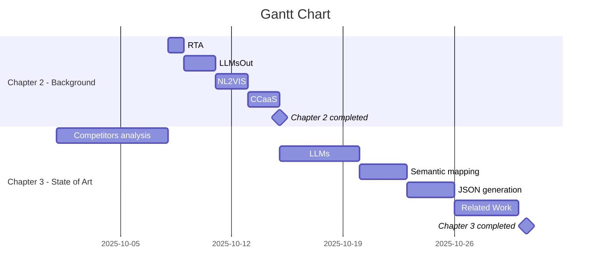

# obsidian_rep

[https://demo.serverdata.net/psl/RealTimeDashboard](https://demo.serverdata.net/psl/RealTimeDashboard)
https://www.anymeeting.com/200-962-801/EB51DD86854A3C

## Duvidas

1. ==Verificar se o flow desde o input até a geração parece bem (ver em especial o semantic Mapping, não sei se é relevante falar sobre isto tão afundo)== isto está bem, não é certo que vá precisar disto ou se há alguma forma de o LLM dar logo o JSON bem, vou ter reunião para confirmar isto
2. ==na terceira etapa do flow é melhor passar para JSON, há alguma hipotese melhor ou esta abordagem está errada?== ver como widgets são gerados para saber o schema do JSON
3. ==Vou ter que usar um LLM com API publica? Ou para já pode ser apenas tudo local (ollama)?== Usar API da intermedia (litellm)

sobre o semantic mapping -> falar com o tiago para tentar saber como é que é são geradas as widgets

# duvidas pt.2
- ==Descobrir como são gerados os JSON==
- ==Ver que API posso usar (em principio vai ser a deles)==
- ==Saber se tenho que enviar o semantic mapping para o LLM ter contexto ou ele consegue de alguma forma gerar o JSON bem==

**NEXT STEPS**
- review llms
- review papers and articles
- Conclude all the state of art sections
- gantt chart (IN PROGRESS)

